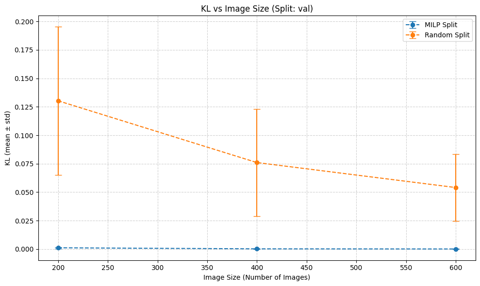

This repo utilizes Mixed Integer Linear Programming (MILP) to perform a stratified k-way split of 
COCO datasets. The figure below compares the KL-divergence between class distributions in the initial dataset and those in the validation set obtained from an 80/20 train–validation split. Results are shown for both the MILP-based splitter and a random image-based split.

Note, a better metric would be to compare MILP with a greedy algorithm but the greedy algorithm has
not been written.

For a simple example see `stratification_examples.ipynb` if one wants to run a stratified split on a COCO dataset. To examine split statistics, refer to the file `stratification_statistical_analysis.ipynb`. There are still a few linter

## MILP Description

The problem inputs are:

- Images $i\in \mathcal{I}$, classes $c\in \mathcal{C}$, partitions $j\in\{1,\cdots,k\}$
- Class counts per image $w_{i,c}\in \mathbb{Z}$
- Global image total $N=|\mathcal{I}|$
- Class count totals $T_c = \sum_i w_{i,c}$
- Partitions $r_j > 0$ with $\sum_j r_j = 1$. For example $r=(0.8,0.2)$ for an 80/20 train/test split.

The MILP variables are:

- Assignment $x_{i,j} \in \{0,1\}$ (image $i$ goes to partition $j$)
- Ratio/Cardinality deviation slack variables: $u_j^{+},u_j^{-} \geq 0$
- Class-count deviation slacks: $e_{j,c}^{+},e_{j,c}^{-} \geq 0$

The +/- are standard L1 slack variables used to convert an L1 objective to a linear problem.

The MILP constraints are:

1. Exact assignment:

$$
\sum_{j=1}^{k} x_{i,j} = 1 \,\, \forall i\in \mathcal{I}
$$

2. Cardinality close to weight ratios (Let $N_j = \sum_{i} x_{i,j}$)

$$
N_j - r_j N = u_j^{+} - u_j^{-}
$$

3. Class distribution close to global distribution (Let $W_{j,c} = \sum_{i} w_{i,c} x_{i,j}$)

$$
W_{j,c} - r_j T_c = e_{j,c}^{+} - e_{j,c}^{-}
$$

The MLP objective is:

$$
\min \left( \lambda_{card} \sum_{j} (u_j^{+} + u_j^{-}) + \lambda_{cls} \sum_{j,c} \gamma_{c} (e_{j,c}^{+} + e_{j,c}^{-}) \right)
$$

Where $\gamma_{c}$ is a class normalization factor, and $\lambda_{card}$ and $\lambda_{cls}$ are weights
used to control the relative importance between the desired objectives (the default is $\lambda_{card} = 1.0$ and $\lambda{cls} = 10.0$)
